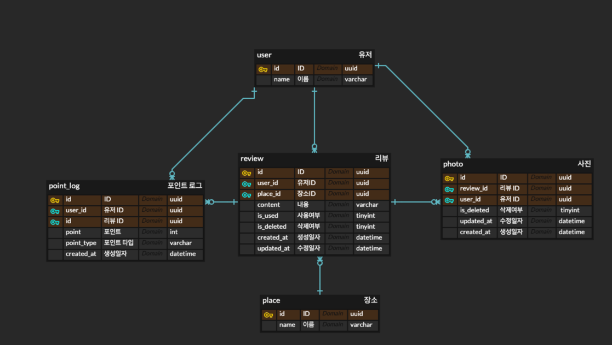

# 과제전형
트리플 백엔드 과제전형입니다.

### 개발환경
- MacOS (M1)
- Typescript
- Nestjs
- Node 14.18.3
- Mysql 8
- Docker

## 실행
### 로컬
1. 초기 table, data 를 생성합니다. 설정을 변경해야한다면 [package.json](package.json) 에서 변경할 수 있습니다.
```
npm run mysql:table     # create table 
npm run mysql:data      # create data
```

2. 서버를 실행합니다.
```
npm run start:local
```

환변변수는 .env.local 에 작성됩니다.

### 도커
[여기](mysql/sqls)에 작성된 쿼리를 통해 초기 table, data 가 생성됩니다.

```
docker-compose up --build
```

환변변수는 .env.docker 에 작성됩니다.

## 테스트
환변변수는 .env.test 에 작성됩니다.

DB 에 의존하는 테스트가 있으므로 초기 테이블을 생성해야합니다.
```
npm run mysql:table:test
```

### unit test
유닛 테스트는 ./src/module/**/test 경로의 *.spec.ts 파일에 작성되어있습니다.

```
npm run test:watch
```

### e2e test
e2e 테스트는 [여기](test)의 *.e2e-spec.ts 파일에 작성되어있습니다.


```
npm run test:e2e
```

## API
1. 리뷰를 생성, 수정, 삭제합니다.
```
# uri
http://localhost:3000/events

# body
{
    "type": "REVIEW",
    "action": "ADD",
    "reviewId": "1adc1726-7041-4f86-88d5-4bb7f31665b3",
    "content": "좋아요!",
    "attachedPhotoIds": [
        "c1029296-1ce0-49bf-9fac-6476820181fb",
        "dd77cefc-7ddc-4cf5-a61c-5a09b4e01fb9",
        "fa87bb80-39d2-4da6-857e-f89d2ab0efb9"
    ],
    "userId": "52a21165-1de2-4703-aa87-a06ed41cec69",
    "placeId": "0d9b0c6c-3df6-48e4-9fba-6708e2c35a51"
}
```

2. 유저가 작성한 review 에 대한 총 point 를 조회합니다.
```
http://localhost:3000/user/:id/review/points
# http://localhost:3000/user/52a21165-1de2-4703-aa87-a06ed41cec69/review/points
```

## 데이터베이스
### DDL
DDL 은 [여기](mysql/sqls/create.sql)서 확인할 수 있습니다.


## Descriptions
- 포인트 증감 이력은 point_log 테이블에 적재되며 수정되거나 삭제되지 않습니다. 증가할 때는 point 가 +, 감소할때는 - 로 설정됩니다.
- 포인트 계산은 point_log 테이블을 이용합니다. 또는 계산된 point 를 저장할 column 생성 혹은 캐싱을 이용할 수 있을것 같습니다.
- review 의 삭제는 is_used, is_deleted 로 결정되며, review 가 삭제되면 관련된 photo 도 삭제됩니다.
- 사용자, 장소에 대해 UNIQUE 제약조건이 작성되어 있습니다.